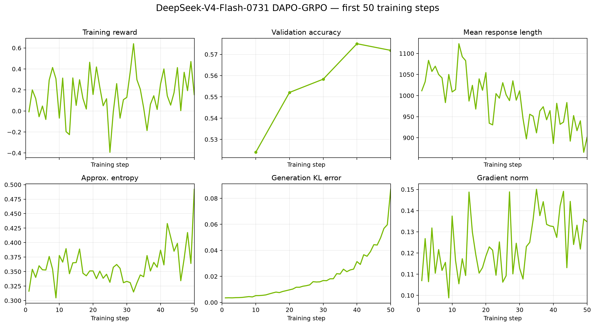

# DeepSeek V4 Flash

This guide describes GRPO training of DeepSeek V4 Flash and Flash Base with the
AutoModel training backend and vLLM generation.

> [!IMPORTANT]
> **Status: Functionally Ready.** The reference recipe has been validated with
> an end-to-end multi-node run. Its smoke test is manual-only because it
> requires a 16-node H100 allocation. This is not a long-run convergence claim.

## Support Status

| Model | Training backend | Validated training parallelism | Generation backend | Status |
| --- | --- | --- | --- | --- |
| `deepseek-ai/DeepSeek-V4-Flash-0731` | AutoModel | TP1 + CP8 + EP128 | vLLM with TP8 + EP1 | Functionally Ready |
| `deepseek-ai/DeepSeek-V4-Flash-Base` | AutoModel | TP1 + CP8 + EP128 | vLLM with TP8 + EP1 | Functionally Ready |

## Validated Scope

- **Models**: `deepseek-ai/DeepSeek-V4-Flash-0731` and
  `deepseek-ai/DeepSeek-V4-Flash-Base`.
- **Algorithm**: GRPO with `DAPOMath17K` for training and
  `DAPOMathAIME2024` for validation.
- **Training backend**: AutoModel with BF16 training, activation checkpointing,
  TileLang attention, and the DeepEP expert dispatcher.
- **Training parallelism**: TP1, CP8, and EP128 on 128 GPUs. CP and EP are
  model-owned parallel dimensions that coexist on the same device mesh; they
  are not multiplicative.
- **Generation backend**: vLLM with TP8, EP1, blockwise FP8 weights, and the
  `fp8_ds_mla` KV cache.
- **Sequence length**: 1,024 prompt tokens plus up to 2,048 response tokens,
  for a maximum total sequence length of 3,072.
- **Reference allocation**: 16 nodes with 8 H100 GPUs per node.
- **MTP**: Disabled by setting `num_nextn_predict_layers: 0`.

Recipe YAML files under `examples/configs/recipes/` are the source of truth for
resource, parallelism, dataset, and checkpointing settings.

## How to Run

### 1. Prepare the Environment

Use the dependency lock and AutoModel submodule recorded by the NeMo RL
revision that contains this guide. From the repository root, run:

```bash
git submodule update --init --recursive
uv sync --locked
```

For a large multi-node run, use a container built from the same checkout so its
backend-specific worker environments match the lockfile. See the
[installation guide](../../../about/installation.md) and
[Dependency Management](../../../design-docs/dependency-management.md) for
container and development setup details.

The recipe downloads the following model and datasets from Hugging Face:

- `deepseek-ai/DeepSeek-V4-Flash-0731` or
  `deepseek-ai/DeepSeek-V4-Flash-Base`
- `BytedTsinghua-SIA/DAPO-Math-17k`
- `BytedTsinghua-SIA/AIME-2024`

Set `HF_HOME` to a cache visible from every node:

```bash
export HF_HOME=<path-to-shared-huggingface-cache>
export WANDB_API_KEY=<your-wandb-api-key>
```

The reference recipe enables W&B logging. If W&B is not configured, pass
`logger.wandb_enabled=false` when launching.

### 2. Choose the Reference Recipe

| Model | Algorithm | Backend | Scale | Recipe |
| --- | --- | --- | --- | --- |
| DeepSeek-V4-Flash-0731 | GRPO | AutoModel | 16n8g | [`grpo-deepseek-v4-flash-0731-16n8g-automodel-cp8ep128.yaml`](../../../../examples/configs/recipes/llm/grpo-deepseek-v4-flash-0731-16n8g-automodel-cp8ep128.yaml) |

The associated
[`grpo-deepseek-v4-flash-0731-16n8g-automodel-cp8ep128.sh`](../../../../tests/test_suites/llm/grpo-deepseek-v4-flash-0731-16n8g-automodel-cp8ep128.sh)
test runs two training steps. It is disabled in the recurring test suite and is
intended for manual validation on a matching allocation.

### 3. Launch

From a 16-node allocation with 8 H100 GPUs per node, launch the standard GRPO
entry point:

```bash
uv run examples/run_grpo.py \
  --config examples/configs/recipes/llm/grpo-deepseek-v4-flash-0731-16n8g-automodel-cp8ep128.yaml
```

The recipe defaults to `DeepSeek-V4-Flash-0731`. To run Flash Base with the
same configuration, override the model and tokenizer:

```bash
uv run examples/run_grpo.py \
  --config examples/configs/recipes/llm/grpo-deepseek-v4-flash-0731-16n8g-automodel-cp8ep128.yaml \
  policy.model_name=deepseek-ai/DeepSeek-V4-Flash-Base \
  policy.tokenizer.name=deepseek-ai/DeepSeek-V4-Flash-Base
```

See the [GRPO guide](../../grpo.md) for algorithm and common configuration
details and [Cluster Setup](../../../cluster.md) for multi-node launch setup.
Before changing the node count, review the training and generation parallel
dimensions instead of changing `cluster.num_nodes` alone.

## Important Recipe Settings

- `policy.dequantize_base_checkpoint: true` loads either checkpoint as BF16
  weights for training. Flash-0731 stores its expert weights in FP4, while
  Flash Base stores them in FP8. Training-side FP8 fake quantization is not
  enabled.
- `policy.hf_config_overrides.expert_dtype: fp8` selects the FP8 expert layout
  used for generation. Keep the checkpoint's own `quantization_config` intact
  so AutoModel can dequantize the training weights correctly.
- Generation uses DeepGEMM with UE8M0 power-of-two scales. Keep
  `VLLM_USE_DEEP_GEMM_E8M0=1`, `use_deep_gemm: true`, and
  `pow2_weight_scaling_factors: true` aligned.
- The policy tokenizer uses `chat_template: deepseek_v4`, while vLLM uses
  `tokenizer_mode: deepseek_v4`. The reference recipe disables thinking mode.
- The recipe sets `VLLM_USE_RAY_V2_EXECUTOR_BACKEND=0` and enables eager
  execution. Treat both settings as part of the validated configuration.

## Reference Training Curves

The following curves were produced with `DeepSeek-V4-Flash-0731` on the
16-node H100 configuration described above. They show the raw, unsmoothed
training and validation metrics through training step 50.



## Known Limitations

- The checked-in support is limited to `DeepSeek-V4-Flash-0731` and
  `DeepSeek-V4-Flash-Base` with the AutoModel training backend and vLLM
  generation. DeepSeek V4 Pro, Megatron training, and SGLang generation are not
  covered by this guide.
- Training uses dequantized BF16 weights, while generation uses refitted FP8
  weights. Without training-side fake quantization, the two paths are not
  numerically identical.
- MTP is disabled in the reference configuration.
- The reference smoke test requires 128 H100 GPUs and is not part of recurring
  CI.
- Long-run convergence has not been documented for this recipe.
