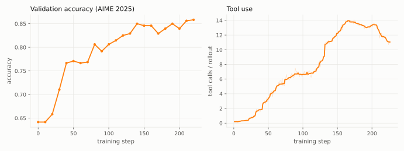

# Math with Code

Multi-turn RL on boxed-answer math problems where the policy can execute Python
inside an isolated per-trial Singularity container. Built on nemo-gym's Harbor
harness with a custom agent (`MathCodeHarborAgent`) that drives a persistent
in-container Python session, and trained with NeMo-RL async GRPO.

## Layout

```
research/math_with_code/
├── responses_api_agents/harbor_agent/  # Overlay fork of nemo-gym's harbor_agent server
│   ├── custom_agents/math_code_*.py    #   the math-code agent + persistent Python session
│   ├── math_code/                      #   all tooling: dataset build, node preflight, venv build, runtime validation
│   ├── configs/math_code_harbor_agent.yaml
│   └── data/math_code/                 #   generated datasets (gitignored)
├── configs/                            # NeMo-RL training config
├── reports/                            # experiment writeups + figures (see Results and Reports)
└── docker/                             # SIF build, only for def changes/new arch — prefer the prebuilt pull (see Bring-up)
```

## Results

Reference run: Qwen3-30B-A3B-Instruct-2507 trained with this recipe (BF16,
async GRPO, ~220 steps). Validation is AIME 2025, 30 tasks x 16 rollouts each:

| Qwen3-30B-A3B-Instruct-2507 | AIME 2025 |
|---|---|
| Reported ([model card](https://huggingface.co/Qwen/Qwen3-30B-A3B-Instruct-2507), no tool) | 61.3 |
| Step 0 on this harness (with the Python tool, before training) | 64.2 |
| After training (best, step 220) | **85.8** |

The gain is not just score: the model *learns the tool*. At step 0 rollouts
barely touch Python (\~0.2 calls each); training grows steady tool use to \~7
calls per rollout, then goes through a phase transition around step 130 into a
heavy tool-iteration regime (\~14 calls, 15+ turns, responses growing from
\~6.5k to \~11k tokens) — and the late accuracy gains ride on that transition.



*Left: AIME 2025 validation accuracy over training. Right: mean Python tool
calls per rollout (centered rolling median, w=9, over the raw trace).*

See [`reports/`](reports/) for the full experiment writeups (FP8 rollout A/B
and the router-precision ablation).

## Bring-up

This assumes a working single-turn NeMo-RL GRPO launch on the target cluster;
use its standard container and `sbatch + ray.sub` flow. Math-with-code adds a
per-trial SIF, a shared Harbor venv, and `/dev/fuse:/dev/fuse` in every
container mount. Check out all submodules first:

```bash
git submodule update --init --recursive
```

Run the one-time setup inside the training container on a compute node of the
target architecture. Run from a repo checkout on storage shared by every
training node. Select the architecture once; no absolute artifact paths are
required:

```bash
cd <repo-root>
MATH_CODE_ARCH=x86_64  # use aarch64 on Grace/GB200
source research/math_with_code/math_code_paths.sh
```

The default layout keeps the complete bring-up under this project:

- SIF and Harbor venv:
  `research/math_with_code/.artifacts/<architecture>/`
- generated task trees and request JSONL:
  `research/math_with_code/responses_api_agents/harbor_agent/data/math_code/`
- checkpoints and training logs:
  `research/math_with_code/.artifacts/runs/`

These paths are gitignored. NeMo-RL's standard `MOUNTS="$PWD:$PWD"` mounts the
whole checkout at the same location in every container, so none of them needs
an additional mount. The generated task TOMLs store a project-relative SIF
reference, which the custom Singularity environment resolves independently of
its process working directory.

Set `MATH_CODE_ARTIFACT_ROOT` only if the repo is not on storage shared by all
training nodes. The helper intentionally ignores the training image's
container-local `NEMO_GYM_VENV_DIR=/opt/gym_venvs` default.

### Step 1 — pull the matching prebuilt SIF

This requires `apptainer`. If it is not installed on the host, run this step
inside the NeMo-RL training image on a compute node; the training image
includes Apptainer. Use the cluster's usual containerized `srun`/`sbatch`
entry point rather than installing Apptainer on the login node.

```bash
mkdir -p "$MATH_CODE_ARTIFACT_ROOT"
if [[ -r "$MATH_CODE_SIF_PATH" ]]; then
    echo "Reusing existing SIF: $MATH_CODE_SIF_PATH"
else
    apptainer pull "$MATH_CODE_SIF_PATH" \
        "oras://ghcr.io/zpqiu/math-code-sif:py312-$MATH_CODE_ARCH"
fi
```

Use `apptainer pull --force` only when intentionally refreshing an existing
image.

### Step 2 — build the shared Harbor venv

```bash
research/math_with_code/responses_api_agents/harbor_agent/math_code/build_harbor_venv.sh
```

### Step 3 — materialize the datasets

This downloads the train source and builds the non8 train set plus AIME 2024
and 2025 validation task trees. It requires Hugging Face access on the first
run. To avoid anonymous Hub rate limits, set `HF_TOKEN` through the cluster's
usual secret mechanism. Optionally set `HF_HOME` to the user's preferred
shared cache location and include that location in the training container
mounts.

```bash
research/math_with_code/responses_api_agents/harbor_agent/math_code/build_datasets.sh
```

### Step 4 — validate the complete runtime

This runs one deterministic Harbor task against a local fake Responses API. It
does not start a policy model or use GPUs, but exercises the real SIF,
persistent Python session, verifier, and NeMo-Gym response conversion.

```bash
research/math_with_code/responses_api_agents/harbor_agent/math_code/validate_runtime.sh
```

The following is an equivalent shortcut for steps 2–4. It first builds or
validates the Harbor venv, then materializes or reuses datasets whose task
TOMLs point at the selected project-local SIF, and finally runs the same real
runtime smoke test:

```bash
research/math_with_code/responses_api_agents/harbor_agent/math_code/bringup_math_with_code.sh
```

It reuses a healthy venv and datasets whose task TOMLs already reference the
requested SIF. Set `MATH_CODE_VENV_FORCE_REBUILD=1` or
`MATH_CODE_FORCE_REBUILD=1` only after changing the corresponding inputs.

### Step 5 — train

Launch is the standard `sbatch + ray.sub` flow from
[docs/cluster.md](../../docs/cluster.md) with two math-code additions: a
repo-root symlink that lets the overlay fork win nemo-gym's cwd-first server
discovery (see "How the overlay fork works"), and a per-node preflight in
`SETUP_COMMAND`:

```bash
cd <repo-root>
MATH_CODE_ARCH=x86_64
source research/math_with_code/math_code_paths.sh
ln -sfn research/math_with_code/responses_api_agents responses_api_agents

SETUP_COMMAND="export MATH_CODE_ARCH=$MATH_CODE_ARCH && \
    source research/math_with_code/math_code_paths.sh && \
    ./research/math_with_code/responses_api_agents/harbor_agent/math_code/preflight_math_with_code_node.sh" \
COMMAND="export MATH_CODE_ARCH=$MATH_CODE_ARCH && \
    source research/math_with_code/math_code_paths.sh && \
    uv run python examples/nemo_gym/run_grpo_nemo_gym.py \
    --config research/math_with_code/configs/grpo_math_with_code_qwen3_30ba3b_instruct_async_h100.yaml" \
CONTAINER=<training image> \
MOUNTS="$PWD:$PWD,/dev/fuse:/dev/fuse" \
GPUS_PER_NODE=8 \
    sbatch --nodes=2 --account=... --partition=batch --gres=gpu:8 \
    --job-name=math-code-30b-bf16-h100 ray.sub
```

The H100 config uses one TP2 vLLM generation node and one TP4/EP8 Megatron
training node. It disables W&B for bring-up; enable it explicitly for tracked
runs. The GB200 BF16 and final FP8 rollout recipes are the corresponding 30B
configs without the `_h100` suffix.

### Custom SIFs

For a customized image, edit the matching `docker/math_code_<arch>.def` and
run `docker/build_math_code_sif_local.sh` inside a compatible compute-node
training container. By default it publishes to the same repo-local artifact
path; set `SIF_OUT` only to override that location. The script is
scheduler-neutral and performs both image and isolated-runtime smoke tests.
Rerun steps 3–4 (or the shortcut above) afterwards.

## Data

Nothing under `responses_api_agents/harbor_agent/data/` is committed — the
directory is fully gitignored.

The data model has two layers that must stay consistent:

- The **request JSONL** (`data.train.data_path` in the training config) is
  only the index NeMo-RL's dataloader iterates; each row references a task in
  one of the agent's `harbor_datasets`.
- The **task tree** (one directory per task: `instruction.md`, `task.toml`,
  `tests/`, `environment/`) is what Harbor actually executes. All trees live
  directly on shared storage under `data/math_code/<alias>/`. They cost ~8
  inodes/task, fine at the few-thousand-task scale used here; if you scale to
  a much larger set, revisit (git history has a tar.gz + node-local staging
  flow that was removed for simplicity).
- The dataset **alias** ties the layers together: it must match the
  `harbor_datasets` key in `configs/math_code_harbor_agent.yaml` (whose
  `local_dataset_path` points at the task tree) and the JSONL filename in
  `data.train.data_path`.

Datasets come from two places:

- **Filtered train source** (6389 DAPO prompts Qwen3-8B did not solve 8/8):
  published as
  [alex-chiu/DAPO-Math-17k-Qwen3-8B-non8](https://huggingface.co/datasets/alex-chiu/DAPO-Math-17k-Qwen3-8B-non8)
  (public), source-format rows. Publishing this subset matters because the
  filter cost a full difficulty-labeling campaign (8 rollouts x 17398 prompts).
- **Everything else rebuilds from one script.** `build_datasets.sh` (under
  `responses_api_agents/harbor_agent/math_code/`) builds the full supported
  set — non8 train + AIME 2024/2025 val — in one pass. From the repo root:

```bash
source research/math_with_code/math_code_paths.sh
research/math_with_code/responses_api_agents/harbor_agent/math_code/build_datasets.sh
```

The default SIF reference, sources, aliases, task counts, and reward shaping
are fixed by the project helpers. The script converts the non8 subset (task
ids renumbered `task_000000..task_006388`, tree/JSONL pair self-consistent),
[tongyx361/AIME-2024-Boxed](https://huggingface.co/datasets/tongyx361/AIME-2024-Boxed),
and [math-ai/aime25](https://huggingface.co/datasets/math-ai/aime25) (plain
problem/answer rows, adapted via `convert_plain_problem_answer.py` so prompts
match the train template).

The train set is built with `--tool-shaping`: ReTool-style reward shaping baked
into the tasks (failed answers earn 0.1 per executed tool call, capped at 0.4;
see `math_code/templates/verify.py`). Eval sets are built without it, so eval
accuracy stays a pure correctness metric.

For a custom dataset, drive `prepare_dataset.py` directly — it accepts a HF
dataset name, local parquet shards, or Dataset Server JSON, plus
`--sif-path/--tasks-dir/--jsonl-path` and optional `--tool-shaping`.

Harbor trial outputs land in `responses_api_agents/harbor_agent/jobs/`
(gitignored). Successful trials are deleted automatically; failed ones are kept
for diagnosis and are worth purging occasionally to protect shared-fs inodes.

## Reports

- [`reports/fp8_rollout_30b/REPORT.md`](reports/fp8_rollout_30b/REPORT.md) —
  FP8 rollout for multi-turn agentic RL on the 30B MoE, structured after (and
  destined to merge into) the single-turn `low-precision-rl-tech-report`:
  BF16 reference curves, FP8 (router BF16) tracking-or-beating them, and the
  router-precision ablation showing quantized routing suppresses the task's
  tool-use phase transition. Curves are stitched from the wandb chains in
  `nv-welcome/grpo-math-with-code`.

## Residual diffs outside this directory

Kept in core because they are generic bug fixes (upstream candidates, not
research-specific):

- `nemo_rl/algorithms/async_utils/trajectory_collector.py` — propagate
  background rollout failures instead of hanging; drain-on-pause for
  validation; `max_inflight_prompt_groups` knob.
- `nemo_rl/algorithms/grpo.py` — failure-channel call sites + re-raise.
- `nemo_rl/environments/math_environment.py` — double-append reward fix on the
  verifier exception path.

## How the overlay fork works

The Gym submodule (`3rdparty/Gym-workspace/Gym`) stays pristine at its pinned
commit. This project carries a forked copy of the entire
`responses_api_agents/harbor_agent` server directory, wired in via three
mechanisms:

1. **Server discovery** — nemo-gym checks `Path.cwd()/<server_rel_path>` before
   its install location (`nemo_gym/cli.py`). The repo-root symlink
   `responses_api_agents -> research/math_with_code/responses_api_agents`
   (created in the Bring-up launch step) makes the fork win; `config_paths`
   resolution works the same way. The root `.gitignore` excludes this runtime
   symlink; recreate it with the same `ln -sfn` on a fresh clone.
2. **Python imports** — the editable nemo-gym install maps
   `responses_api_agents.*` to the pristine submodule via a setuptools
   meta-path finder. PathFinder consults `sys.path` first, so the fork's
   `app.py` prepends the overlay root to `sys.path` (server process) and to the
   Harbor Ray worker's `PYTHONPATH` (`runner_ray_remote` runtime env).
3. **Dependencies** — the fork's `requirements.txt` editable-installs nemo-gym
   from the submodule by relative path.

The trade-off: this directory no longer receives upstream Gym changes to
harbor_agent automatically; sync manually by diffing against the submodule.
