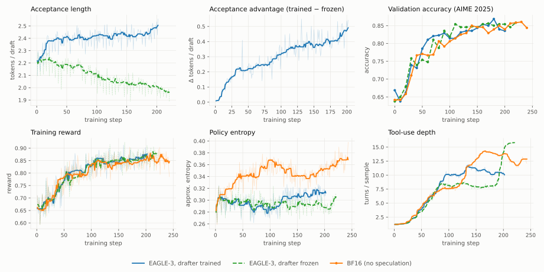
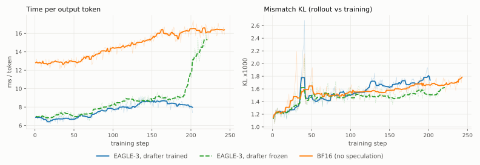

# EAGLE-3 Speculative Decoding for Multi-Turn Agentic RL: Qwen3-30B-A3B on math-with-code

> **Status**: companion to `fp8_rollout_30b/REPORT.md`. Same model, harness,
> cluster and operating point, so the two rollout-acceleration levers (FP8
> weight quantization and speculative decoding) are directly comparable. Data
> through 200 matched training steps (the frozen arm ran to 221).

## Settings

**Task and setup.** Identical to the FP8 study: boxed-answer math problems
where the policy iterates Python in an isolated per-trial container (nemo-gym
Harbor harness, `MathCodeHarborAgent`, up to 16 model-call steps per rollout).
Model: Qwen3-30B-A3B-Instruct-2507 (MoE, non-thinking). NeMo-RL async GRPO on
4 GB200 nodes — 2 generation nodes (vLLM TP1, 8 replicas) and 2 training nodes
(Megatron-Core TP4 x EP8), non-colocated. Harbor concurrency 512, sampling
temperature 1.0, 20K max sequence length. Token-level GRPO with TIS (C=2).

**Drafter.** `lmsys/SGLang-EAGLE3-Qwen3-30B-A3B-Instruct-2507-SpecForge-Nex`
— an EAGLE-3 head trained for exactly this base model on generic chat data
(open-perfectblend). One decoder layer, hidden 2048, draft vocab 32000.
vLLM runs it with `num_speculative_tokens=3`, `draft_tensor_parallel_size=1`.

> **Checkpoint gotcha.** The published checkpoint ships
> `max_position_embeddings=2048` (its training length) and vLLM clamps the
> drafter's rope to it. Past position 2048 the drafter keeps proposing but
> acceptance collapses to 1.012 (rate 0.4%) — pure draft overhead on 20K
> multi-turn contexts, and it presents as "speculative decoding does not help
> here" rather than as an error. A local copy with that field raised to 40960
> restores acceptance 2.184 at a 6875-token prompt. All results below use the
> patched copy.

**Arms.** Two otherwise byte-identical configurations:

| arm | `policy.draft.enabled` | drafter during RL |
|---|---|---|
| online | true | trained with the policy; `draft.*` weights refit into vLLM each step |
| frozen | false | fixed at the initial checkpoint while the policy trains |

Online draft training requires the Megatron backend and forbids sequence
packing, so **packing is disabled in both arms** to keep that cost common-mode.
The draft loss is a forward-KL distillation against the policy's own detached
logits, added as `L_total = L_policy + λ·L_draft` with λ=1.0.

**Metrics.** vLLM's speculative-decoding counters, aggregated per training
step and closed before validation so the window covers only
training-distribution rollouts: *acceptance length* (mean tokens emitted per
draft, = 1 + accepted/drafts) and per-position acceptance rate. Acceptance
length is the quantity that maps to decode speedup.

> **Analyze paired, per matched step.** Each arm's step-to-step standard
> deviation is 0.09-0.11, which swamps the effect; but that noise is almost
> entirely common-mode (both arms see the same step-indexed data and warmup
> fluctuations), so the paired difference has sd 0.025. The paired design is
> roughly 4x more sensitive, and comparing the two curves directly hides the
> result for the first ~15 steps.

## Results

Speculation was already established as worthwhile at this operating point in a
prior offline-drafter window: +82% per-stream generation throughput and -29%
validation wall against a no-speculation control at conc512, accuracy neutral,
with acceptance 2.10. That measurement answers "does speculation pay when
sampling at temperature 1.0 under high concurrency" — it does, because MoE
decode here is weight-traffic bound. This report answers the follow-on
question that only exists in RL: **what happens to the drafter as the policy
moves underneath it.**

The paired difference is positive at **all 200 matched steps** (mean +0.2971,
sd 0.1201, t=35.0). Decomposed into 25-step blocks:

| steps | online | frozen | delta | advantage |
|---|---|---|---|---|
| 1-25 | 2.295 | 2.209 | +0.086 | +3.9% |
| 26-50 | 2.381 | 2.168 | +0.213 | +9.8% |
| 51-75 | 2.405 | 2.174 | +0.231 | +10.6% |
| 76-100 | 2.394 | 2.116 | +0.277 | +13.1% |
| 101-125 | 2.412 | 2.057 | +0.355 | +17.2% |
| 126-150 | 2.425 | 2.038 | +0.387 | +19.0% |
| 151-175 | 2.420 | 2.026 | +0.394 | +19.5% |
| 176-200 | 2.444 | 2.010 | +0.434 | +21.6% |

**Two mechanisms fire in sequence, and they trade off around step 50.**

*Early — domain adaptation.* The online drafter climbs from 2.231 to ~2.40 in
the first 50 steps while the frozen drafter holds flat. This is a generic-chat
EAGLE head learning our multi-turn math-code distribution, and it saturates:
over the last 120 steps the online arm's slope is +0.0005/step, i.e. it sits
on a plateau near 2.44 and stops improving.

*Late — staleness.* The frozen drafter decays monotonically once adaptation is
over: -0.0008/step across the last 120 steps, from a peak of 2.21 down to
1.96, a **14.3% loss**. It ends up **4.4% below the offline-drafter baseline
it started from**, so a drafter that is merely "good at the base model" is
worse than useless once the policy has moved 200 steps. Every bit of the
delta's growth after step 50 comes from this side.

The practical consequence is the important one: the online arm's advantage
**does not converge**. It grows monotonically block over block (+3.9% → +21.6%)
and is still widening at cutoff, because the driver is policy drift, which
continues as long as training does. This is the opposite of the reading a short
run gives — at 40 steps the same experiment showed a saturating ~+10% and
attributed it to adaptation.

**Net at 200 steps**: +23.1% tokens per draft over the last 10 matched steps
(online 2.472 vs frozen 2.008); online is +17.8% over the offline baseline
while frozen is -4.4% under it.

## Rollout performance

The FP8 study's rollout-speed metric is *time per output token* = mean
model-call wall seconds / mean generated tokens (batch sum/sum identity), the
wall clock being the HTTP call with tool execution excluded. **That metric does
not survive the move to deep multi-turn rollouts**, and this campaign shows why:
the harness accumulates it per rollout across every turn, so it charges each
token with a share of the per-turn round trips and re-prefill, neither of which
speculation accelerates. As tool-use depth grows the metric inflates on its own.

The frozen arm makes the failure unmistakable. Across its step-195 transition
its HTTP wall jumps 9.0 → 14.1 ms/token, nearly reaching the no-speculation
reference, while its acceptance length is unchanged at ~1.99 — it had not lost
any speculative benefit. Splitting out vLLM's own per-request decode time shows
the decode cost essentially flat across that transition (8.81 → 8.41).

| window | metric | trained | frozen | BF16 |
|---|---|---|---|---|
| steps 10-60 | decode ms/token | 6.65 | 6.80 | — |
| | HTTP ms/token | 6.69 | 7.08 | 12.90 |
| steps 150-190 | decode ms/token | 7.46 | 8.81 | — |
| | HTTP ms/token | 8.47 | 8.98 | 15.97 |
| steps 200-221 | decode ms/token | 7.04 | 8.41 | — |
| | HTTP ms/token | 7.90 | 14.10 | 16.52 |
| steps 227-243 | decode ms/token | — | — | 15.01 |

Use the decode column. It tracks acceptance length the way theory says it
should — decode cost per token should scale as 1/acceptance, and at steps
150-190 the acceptance ratio is 2.43/2.02 = 1.20 against a decode-time ratio of
8.81/7.46 = 1.18.

**Speculation is worth roughly 1.8-2.1x on decode.** The per-request series only
overlaps the BF16 chain from step 227 (15.01 ms/token at ~12.5 turns); against
it the frozen arm reaches 8.41 ms/token while running *deeper* rollouts (15.7
turns, so longer contexts and slower decode all else equal), which makes 1.8x a
conservative floor, and the trained arm's 7.04 puts it near 2.1x. The
matched-behavior HTTP window early in training (steps 10-60, all arms at ~2.3
turns) agrees: 6.7 vs 12.9 = 1.93x.

Drafter training is second-order against that: ~6% on decode (7.04 vs 8.41),
on top of the ~2x speculation itself buys.

Mismatch KL sits in the same 1.1-1.8x10^-3 band in all three arms across all
200 steps, which is the check that speculation is not skewing the rollout
distribution.

## Cost

Median non-validation step time is **880s (online) vs 814s (frozen)**, so
training the drafter costs about **8%** of step time. This is the price of the
draft forward plus the distillation loss, which is not chunked and whose
cross-entropy up-casts both sides to fp32 and retains two vocab-sized tensors
for backward — reintroducing the allocation `defer_fp32_logits` exists to
avoid. Both figures are far above the 307s of the packed Phase-1 configuration:
**disabling sequence packing, not draft training, is the dominant cost** of
this feature on a MoE policy, since it forfeits permute fusion.

## Practical notes

- Draft parameters land in the policy's optimizer group (lr 2e-6, shared
  `clip_grad`). That is two orders of magnitude below a typical drafter LR, yet
  it produced the full effect above — no separate group was needed. Raising
  `policy.draft.loss_weight` is *not* a substitute for a higher LR: Adam is
  scale-invariant for parameters whose gradient comes only from that loss, and
  a larger draft gradient consumes more of the shared clip-norm budget.
- `draft_loss` oscillates around 0.73 rather than falling. The teacher is
  non-stationary — the drafter is chasing a moving policy — so a flat draft
  loss while the frozen arm falls behind is the mechanism working, not
  evidence of no learning.
- Checkpoint/resume carries the drafter: `draft_model.eagle_module.*` is
  present in the distributed checkpoint (54 entries) and chained segments
  resume with it, so drafter training accumulates across the 4-hour wall.

## Caveats

- **The arms' policies diverge behaviorally, but the effect on acceptance is
  bounded and small.** This workload has a heavy-tool phase transition, and all
  three arms undergo it at different times: the online arm around step 90
  (settling at ~10.1 turns/sample), BF16 around step 130-150 (~13), and the
  frozen arm only at step ~195, where it jumps 8.6 → 15.8. Since the arms sit
  in different behavioral regimes over much of the run, one could worry the
  acceptance gap reflects that rather than drafter staleness.
  Each arm's own transition bounds how much that can matter, as a natural
  experiment: across the frozen arm's transition its tool-use depth grows
  **1.81x** (8.6 → 15.7 turns) while its acceptance moves **-0.040**
  (2.006 → 1.966); across the online arm's, depth grows 1.36x and acceptance
  moves +0.022. A near-doubling of rollout structure is therefore worth about
  ±0.04 acceptance — an order of magnitude below the +0.40 to +0.47 gap between
  the arms at the same steps. Behavioral divergence cannot account for the
  result. A cross-evaluation of both drafters against one policy checkpoint
  would tighten this further but is not needed to support the conclusion.
- **Speculation is not biasing the rollout distribution.** `gen_kl_error`, the
  rollout-vs-training logprob mismatch, is 0.0015-0.0016 in both eagle arms and
  in the BF16 reference, flat across all 160 steps; `sampling_importance_ratio`
  and `probs_ratio` are 1.0000 everywhere. This is the metric that would move
  first if rejection sampling or the returned logprobs were skewed, and it is
  the check the FP8 study used for the same purpose. Mechanistically this is
  also the expected direction: a worse drafter yields more rejections and
  therefore *more* tokens drawn directly from the target model.
- Both eagle arms sit ~12% below the BF16 reference in `approx_entropy`
  (0.287-0.307 vs 0.325-0.359) from step 40 onward — early enough that drafter
  staleness cannot explain it, and common to both arms, so it points at what
  they share against the reference (sequence packing disabled) or at these two
  runs' seeds. Lower entropy is consistent with the weaker/later tool-use
  transition.
- Single seed per arm. The paired design controls common-mode noise but not
  seed-level differences in the policy trajectory.
- Consecutive steps are autocorrelated, so the nominal p-values overstate
  significance; the block structure and the all-positive sign pattern are the
  robust statements.
- Acceptance is measured over a wall-clock window in async mode, so a step's
  reported acceptance covers generations that will be trained on slightly
  later. This is common to both arms.
- The frozen arm's decay is still linear at cutoff, so where it bottoms out is
  not established. Extrapolating the advantage past 200 steps is unsupported.
