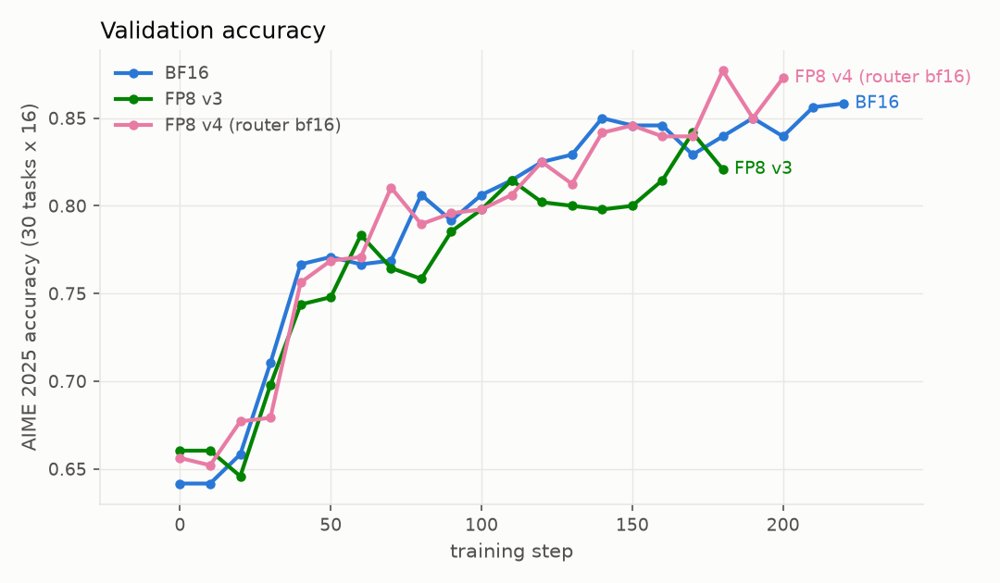
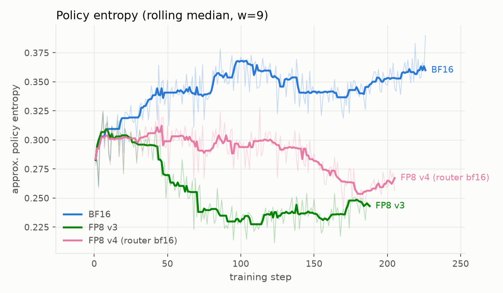
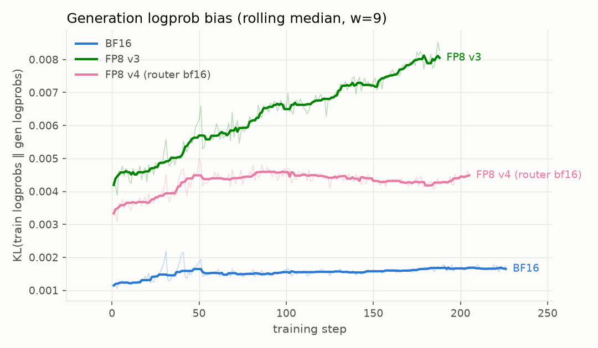
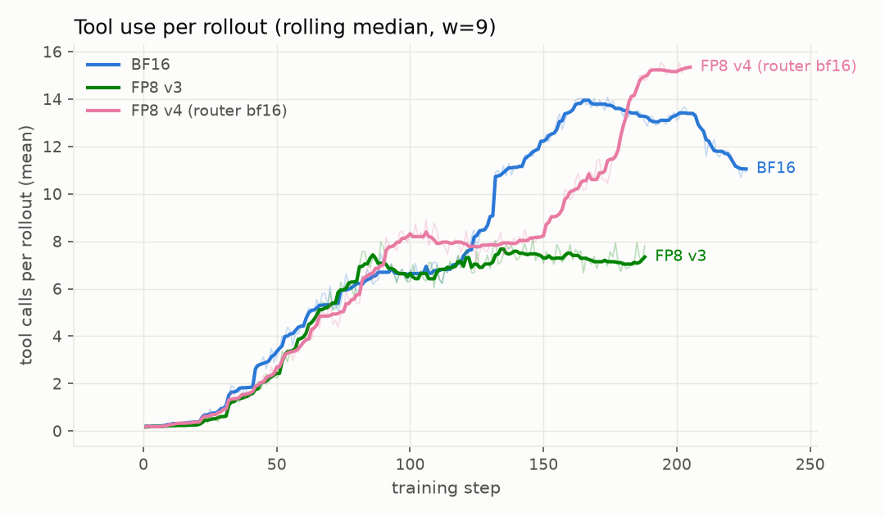

# FP8 rollout on Qwen3-30B-A3B (math-code, async GRPO): BF16 vs FP8

**Scope**: FP8 *generation* only — the vLLM rollout engine serves blockwise FP8
W8A8 while Megatron training stays BF16. (The FP8-training arm `_fp8_e2e_blockwise`
is a separate track and not covered here.)

## Setup

- **Model**: Qwen/Qwen3-30B-A3B-Instruct-2507 (MoE, non-thinking).
- **Task**: multi-turn math-with-code on `dapo_math_17k_non8` (6389 DAPO prompts
  Qwen3-8B did not solve 8/8), ReTool-style tool-use shaping baked into train
  tasks. Validation: AIME 2025, 30 tasks x 16 repeats.
- **Recipe**: async GRPO, token-level loss + TIS(max=2), B64G16 (64 prompts x 16
  generations), conc512/inflight64. GB200 4 nodes = 2 gen (vLLM TP1 x 8
  replicas) + 2 train (Megatron TP4 x EP8), `moe_backend=triton`.
- **Arms** (configs in `../../configs/`):

| arm | config delta | wandb chain |
|---|---|---|
| BF16 | control | `...-non8-async-v3-pty` |
| FP8 v3 | vLLM `precision: fp8`, CUTLASS blockwise W8A8, fp32 scales | `...-non8-async-fp8-v3-pty` |
| FP8 v4 | v3 + router (`mlp.gate`) kept in BF16 via `quantization_ignored_layer_kws` | `...-non8-async-fp8-v4-pty` |

Earlier GSPO-loss windows (v1/v2, not plotted) plateaued at ~0.66–0.75 with the
FP8 arm trailing: FP8's per-token logprob bias compounds in GSPO's
sequence-level IS products over ~6k-token rollouts and collapses the applied
sequence weights (~0.024 vs BF16's ~0.145). Token-level GRPO+TIS removes the
compounding mechanism and is the baseline recipe for everything below.

## Headline results

| chain | best val acc | last val acc (step) | median step time | median exposed gen | median gen tok/s |
|---|---|---|---|---|---|
| BF16 | 0.858 | 0.858 (s220) | 509 s | 20.6 s | 20.9k |
| FP8 v3 | 0.842 | 0.821 (s180) | 431 s (-15%) | 5.2 s | 22.5k (+7.7%) |
| FP8 v4 (router bf16) | **0.877** | 0.873 (s200) | 458 s (-10%) | 5.5 s | 22.2k (+6.2%) |

FP8 v4 matches (and at the endpoint exceeds) BF16 accuracy while keeping the
FP8 throughput win. Step-time medians mix generation- and training-bound
windows; the cleaner generation signal is `exposed_generation` (~4x lower under
FP8) and per-engine tokens/s.

## Curves

### Validation accuracy



The three arms track each other until ~step 120. From there **FP8 v3 falls
behind** (0.80 plateau vs BF16 0.83–0.86) while **FP8 v4 stays on the BF16
trajectory** and ends at 0.873 vs BF16's 0.858.

### Policy entropy — the v3 failure mechanism



FP8 v3 suppresses exploration: entropy collapses to ~0.23–0.25 from step ~70
(-35% vs BF16's 0.34–0.37). v4 sits in between — the router fix recovers most
but not all of the entropy gap, and its accuracy shows no penalty.

### Generation logprob bias



KL between trainer and rollout logprobs: BF16 holds ~0.0015; **v3 grows
0.004 -> 0.008** over training (the policy drifts into regions where FP8
routing noise matters more); **v4 stays flat at ~0.0045** — quantizing the
router was the growing-bias mechanism, not FP8 GEMMs per se.

### Tool use



The task's phase transition into heavy tool use (BF16: ~7 -> ~14 calls/rollout
around step 130) **never happens under v3** — it stays pinned at ~7.4. v4 goes
through the transition (later, ~step 150) and ends *above* BF16 at ~15.4.

## Takeaways

1. **On-the-fly FP8 rollout for this MoE requires excluding the router.**
   vLLM's Fp8Config quantizes `mlp.gate` (ReplicatedLinear) by default; router
   noise flips top-8 expert selection near decision boundaries — a discrete
   computation-path perturbation that suppresses exploration and freezes
   tool-use behavior. The official Qwen FP8 checkpoint also excludes all 48
   `mlp.gate` layers. Fix: `quantization_ignored_layer_kws: ["mlp.gate"]`.
2. **Token-level IS correction is load-bearing under FP8.** Sequence-level
   (GSPO) IS products amplify per-token FP8 bias multiplicatively; GRPO+TIS is
   the stable pairing.
3. **Net win**: with the router in BF16, FP8 rollout gives ~6–8% per-engine
   generation throughput and ~4x lower exposed generation time at equal (or
   slightly better) validation accuracy.

## Reproducing

Chains live in wandb project `nv-welcome/grpo-math-with-code` (each 4h Slurm
window is a same-name run; segments are stitched by step, later segments
winning overlaps):

```bash
source ~/.exp_env   # WANDB_API_KEY
python pull_wandb.py            # -> data/<chain>.csv
python make_figures.py          # -> figures/*.png + summary table
```

Any Python with `wandb`, `pandas`, `matplotlib` works (no repo venv needed).
