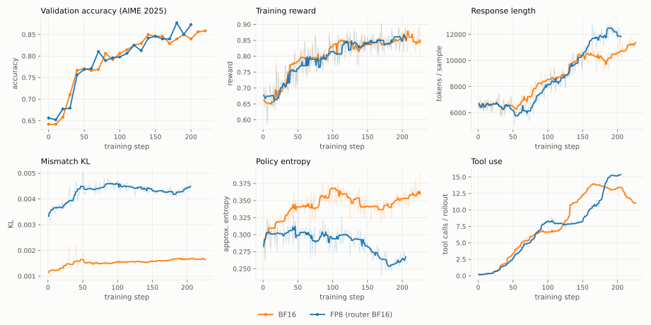
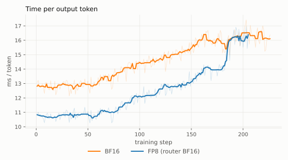
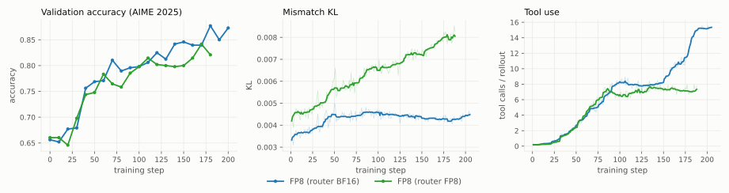
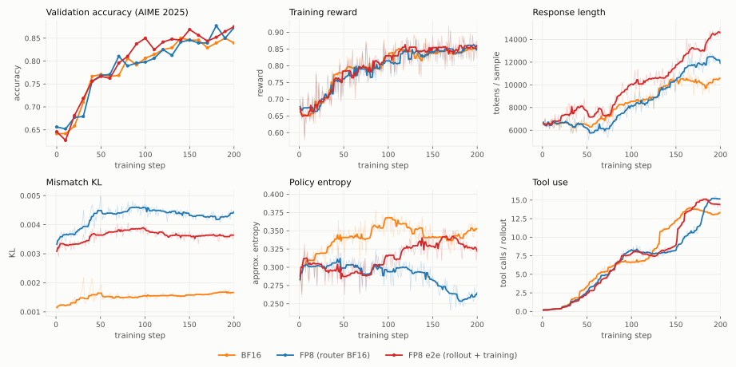
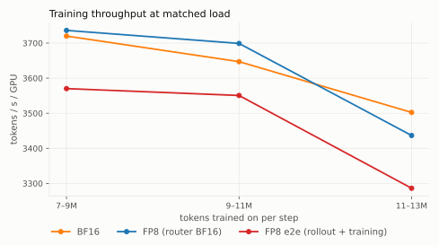

# FP8 Rollout for Multi-Turn Agentic RL: Qwen3-30B-A3B on math-with-code

> **Status**: source material for the multi-turn section of
> `low-precision-rl-tech-report` (which covers single-turn FP8 RL on
> Qwen3-8B/30B-Base with DAPO). This document follows that report's structure
> and figure conventions (orange = BF16, blue = FP8 rollout, green = router
> ablation, red = end-to-end FP8) so the results can be merged directly; the
> BF16 reference training curves below are the ones to preserve through the
> merge.

## Settings

**Training Setup.** We extend the tech report's FP8 W8A8 linear-rollout
evaluation from single-turn math RL to a multi-turn agentic task: boxed-answer
math problems where the policy iterates Python code in an isolated per-trial
container (nemo-gym Harbor harness, `MathCodeHarborAgent`, up to 16
model-call steps per rollout — each step may execute multiple Python tool
calls, and the loop ends early once the model answers without one).
Model: Qwen3-30B-A3B-Instruct-2507 (MoE, non-thinking). Framework: NeMo-RL
async GRPO on 4 GB200 nodes (4 GPUs/node) — 2 generation nodes (vLLM TP1, 8
replicas) and 2 training nodes (Megatron-Core TP4 x EP8), non-colocated.
Training data: 6389 DAPO prompts Qwen3-8B did not solve 8/8, with ReTool-style
tool-use reward shaping baked into train tasks; online validation on AIME 2025
(30 tasks x 16 repeats, shaping-free).

**Hyperparameters.** Prompt batch 64 with n=16 responses per prompt; async
GRPO with trajectory age at most 1 step and 64 in-flight prompt groups.
Token-level GRPO loss (clips 0.2/0.28, dual-clip c=10) with token-level
truncated importance sampling, C=2, applied to all arms — matching the tech
report's rollout-correction recipe. Maximum sequence length 20K. Rollout FP8
is on-the-fly blockwise W8A8 applied at each weight sync; training stays BF16
throughout.

**Metrics.** As in the tech report: (i) *validation accuracy* on AIME 2025;
(ii) *training reward*; (iii) *response length* (generated tokens per sample);
(iv) *mismatch KL* between rollout and training policy logprobs. Multi-turn
adds two behavioral metrics with no single-turn counterpart: (v) *policy
entropy* and (vi) *tool calls per rollout* — the task exhibits a phase
transition into heavy tool use, and whether that transition fires is the most
sensitive indicator of rollout-precision side effects we observed. Rollout
speed is measured by (vii) *time per output token* (ms/token) during
generation, as in the tech report: mean model-call wall-clock seconds per
rollout ÷ mean generated tokens per rollout (the batch-mean ratio equals
Σseconds/Σtokens; the wall clock is the HTTP call covering vLLM queueing,
prefill, and decode,
excluding tool execution). It measures per-request serving speed at matched
load — lower is better — without baking concurrency into the number. The
end-to-end FP8 section adds (viii) *training throughput*
(`performance/policy_training_tokens_per_sec_per_gpu`), which only that arm
can move.

## Results: FP8 W8A8 Rollout with Token-Level TIS

Configurations: (i) BF16 reference (orange) and (ii) FP8 W8A8 with the MoE
router excluded from quantization (blue) — the recommended configuration,
matching the official Qwen FP8 checkpoint's `modules_to_not_convert`. The
router-precision choice is ablated in the next section.

*Figure 1: Training dynamics for BF16 (orange) and FP8 rollout with router in
BF16 (blue). Noisy per-step series show a centered rolling median (w=9) over
the raw trace.*

**Training effectiveness.** FP8 rollout tracks the BF16 reference across all
training metrics. Validation accuracy stays on the reference trajectory
throughout and ends above it (best 0.877 / last 0.873 at step 200 vs BF16's
0.858 at step 220); reward curves overlap; response length grows through the
same multi-turn expansion. Mismatch KL sits at ~0.0045 — elevated over BF16's
~0.0015 by quantization as expected, but *flat* across 200 steps, mirroring
the stability the tech report observed for the single-turn 30B MoE with TIS
enabled. Policy entropy runs below the reference (~0.29 vs ~0.35, with a dip
before the tool-use transition) with no observed accuracy cost.

**Multi-turn observations.** The agentic task adds a behavioral dimension
absent from single-turn RL: around step 130 the BF16 policy transitions into a
heavy-tool-use regime (~7 to ~14 calls/rollout), coinciding with the late
accuracy gains. FP8 rollout undergoes the same transition roughly 50 steps
later and converges to ~15 calls/rollout — rollout quantization delays but
does not suppress the behavioral phase transition, provided the router stays
in BF16.

**Rollout performance.**

*Figure 2: Time per output token during generation (ms/token, tool time
excluded; lower is better). Centered rolling median (w=9) over the raw
trace.*

| window | BF16 | FP8 | Δ |
|---|---|---|---|
| steps 10–60 (early behavior: 1–2 model calls, ~6.5k-token trajectories) | 12.9 ms/token | 10.8 ms/token | **−16.2%** |
| steps 150–200 (late behavior: heavy tool use, ~12k-token trajectories) | 16.0 ms/token | 14.1 ms/token | −12.1% |

FP8 rollout generates each token ~16% faster at matched early-training load.
The metric is strongly behavior-dependent, and specifically it rises with
trajectory length: within each arm, regressing ms/token on tokens/sample over
steps 1–200 gives r = 0.95–0.97 with a slope of 0.69–0.82 ms/token per
additional 1k tokens/sample. We have not profiled the generation path, so this
report does not attribute that dependence to particular costs. The practical
consequence is what matters for reading the table: cross-arm deltas are only
meaningful while the arms are at comparable trajectory lengths, and after the
FP8 arm's later tool-use transition (~step 180) the two curves converge.

Validation adds an end-to-end cross-check. Every 10 steps both arms run the
identical AIME burst — 480 rollouts (30 tasks x 16) submitted together — and
we time the whole burst from start until the *last* rollout finishes, so
stragglers count, exactly as they gate a training step. While the two
policies still behave nearly identically (steps 0–40, mean response lengths
within 2%), this is an apples-to-apples end-to-end comparison: FP8 finishes
the burst in a median 178 s vs BF16's 202 s (−12%), consistent with the
per-token speedup.

## Ablation: Router Precision

The tech report's single-turn router ablation (its §"Ablation: Router
Precision for MoE FP8 Rollout") established that quantizing the router
produces the highest mismatch KL and that BF16 ≈ FP32 for the router. The
multi-turn setting shows what that routing inconsistency does to the *policy*
over a longer horizon. Both arms below run identical FP8 W8A8 rollout and
differ only in router precision.

*Figure 3: Router-precision ablation under FP8 rollout: router in BF16 (blue)
vs router quantized to FP8 (green). Mismatch KL and tool use show a centered
rolling median (w=9) over the raw trace.*

With the router quantized (green), mismatch KL grows steadily 0.004 → 0.008
instead of holding flat; the tool-use phase transition never fires (pinned at
~7.4 calls/rollout while the router-BF16 arm climbs to ~15); and validation
accuracy detaches after step ~120, plateauing near 0.80 with the residual gap
concentrated in the hard problems solved only through heavy tool iteration.
Excluding the router from quantization (blue) arrests all three at no
measurable cost.

Mechanism, consistent with the single-turn KL evidence: vLLM's on-the-fly
`Fp8Config` quantizes the router gate (`ReplicatedLinear`) by default, and
router noise flips top-8 expert selection near decision boundaries — a
discrete computation-path perturbation rather than smooth numeric error. The
RL loop then amplifies the sharpened sampling distribution, and importance
sampling cannot recover trajectories that were never explored. Fix (NeMo-RL):
`quantization_ignored_layer_kws: ["mlp.gate"]`. The official
Qwen3-30B-A3B-Instruct-2507-FP8 checkpoint likewise excludes all 48 `mlp.gate`
layers, and the Megatron trainer runs the router in FP32
(`moe_router_dtype`).

## End-to-End FP8: FP8 Rollout Plus FP8 Training

Everything above keeps training in BF16. This section adds the training side:
Megatron-Core runs its linear-layer GEMMs in FP8 on top of the recommended FP8
rollout. Config:
`configs/grpo_math_with_code_qwen3_30ba3b_instruct_async_fp8_e2e_blockwise.yaml`,
200 steps, otherwise identical data and hyperparameters.

**What changes.** Trainer: `fp8: hybrid` (forward activations/weights e4m3,
backward grads e5m2), `fp8_recipe: blockwise`, `fp8_param: false`. That last
flag governs *model parameter storage*, not optimizer state: Megatron consults
it only at module init (`config.fp8 if not is_init else config.fp8_param`,
`megatron/core/fp8_utils.py`), so leaving it false keeps parameters as
ordinary BF16 tensors instead of TE quantized tensors, and refit re-quantizes
from BF16 exactly as in the rollout-only arm. The optimizer's master weights
are FP32 in every arm here — Megatron's `main_params_dtype` defaults to
`torch.float32` and NeMo-RL does not expose or override it. The training-side
quantization surface is TE `Linear`/`GroupedLinear` GEMMs only — attention
(`fp8_dpa` off), embeddings,
lm_head, and the MoE router (`moe_router_dtype: fp32`) stay high precision,
mirroring the rollout's router exclusion. Rollout: scale factors switch to
power-of-2 (`pow2_weight_scaling_factors`, `pow2_activation_scaling_factors`).

**This is a two-delta arm, not a single-variable A/B.** The trainer's blockwise
path on GB200 requires pow2 scales, so the only way to put trainer GEMMs,
refit weight cast, and rollout activation quant on one shared quantization
geometry — 128-block, power-of-2 — is to move the rollout side too. Grid
alignment is the point of the arm, so both deltas move together, and the
effects below cannot be attributed to FP8 training or to pow2 alignment
individually.

*Figure 4: BF16 (orange), FP8 rollout with BF16 training (blue), and
end-to-end FP8 (red), all capped at the end-to-end arm's step-200 horizon.
Noisy per-step series show a centered rolling median (w=9) over the raw
trace.*

**Training effectiveness — at least as good as either reference.** Validation
accuracy ends at 0.875 (step 200, also its best) against BF16's 0.840 and the
FP8-rollout arm's 0.873 at the same step; it is at or above both across steps
90–160, apart from step 140 where BF16 is 0.4 pt higher. Reward is marginally
the highest of the three (0.853 vs 0.849/0.843, steps 150–200 median). The run
reached step 200 without divergence and with no visible instability in any
tracked series.

**Mismatch KL is lower than the rollout-only arm's.** It settles at ~0.0036
(steps 150–200) versus ~0.0043 — about 16% lower — and is flat across the run
rather than drifting. Both remain above BF16's ~0.0016. This arm moves two
things at once, so it does not identify which of them produces the reduction.

**Entropy tracks the BF16 reference.** Rollout-only FP8 ran persistently below
the reference and declined late (~0.26 by steps 150–200); end-to-end FP8 sits
at 0.332 against BF16's 0.342. It transitions into heavy tool use at step
~152 — between BF16's ~132 and rollout-only FP8's ~160 — and sustains the
longest trajectories of the three (~13.2k tokens/sample at steps 150–200 vs
BF16's ~10.4k). So on every behavioral metric tracked here the arm stays at
or above the BF16 reference rather than below it, which is the failure mode
the router ablation above exhibits.

**Rollout speed.**

| window | BF16 | FP8 rollout | FP8 end-to-end |
|---|---|---|---|
| steps 10–60 | 12.9 ms/token | 10.8 ms/token (−16.2%) | 11.1 ms/token (−13.7%) |
| steps 150–200 | 16.0 ms/token | 14.1 ms/token (−12.1%) | 16.4 ms/token (+2.7%) |

**Neither window is behaviorally matched for this arm**, so read the raw
numbers with care: the end-to-end arm runs longer trajectories than the
FP8-rollout arm throughout — already +14% at steps 10–60 (7380 vs 6491
tokens/sample) and +12% by step 150 — and as §"Rollout performance" notes,
ms/token rises with trajectory length within every arm.
That dependence is near-linear and dominant: regressing
ms/token on tokens/sample over steps 1–200 gives r = 0.95–0.97 and a slope of
0.69–0.82 ms/token per additional 1k tokens/sample. Evaluated at the
end-to-end arm's own early-window length, the FP8-rollout arm's fit predicts
11.5 ms/token against the end-to-end arm's observed 11.1. On that basis the
raw 10.8 → 11.1 difference is within what the length gap alone accounts for,
and the observations are consistent with the FP8 rollout speedup carrying
over to this arm. The matched-load validation burst is the one directly
measured end-to-end comparison and points the same way: median 189 s versus
BF16's 202 s (−6.4%), with the FP8-rollout arm at 178 s on its own shorter
trajectories.

This is a length-controlled inference from a two-arm fit, not a direct
measurement, and it is as far as the data supports — we did not profile the
generation path, so no claim is made here about which kernels account for
any residual. The per-request vLLM window means
(`train/vllm/request_{queue,prefill,decode}_time_mean_s`,
`time_to_first_token_mean_s`) that would separate serving speed from queueing
and prefill were instrumented after this campaign: they cover only the final
segments of the BF16 and FP8-rollout chains (steps 227–243 and 206–221
respectively, non-overlapping) and have zero coverage on the end-to-end run.

**Training speed: no gain — this is the arm's negative result.**

*Figure 5: Policy-training throughput (tokens/s/GPU, higher is better) binned
by how many tokens each step actually trained on. Binning is necessary because
the arms diverge in trajectory length and raw per-step throughput falls as
sequences grow.*

| tokens trained per step | BF16 | FP8 rollout | FP8 end-to-end |
|---|---|---|---|
| 7–9M | 3720 | 3736 (+0.4%) | 3570 (**−4.0%**) |
| 9–11M | 3647 | 3699 (+1.4%) | 3551 (**−2.6%**) |
| 11–13M | 3502 | 3437 (−1.9%) | 3286 (**−6.2%**) |

FP8 training is 3–6% *slower* than BF16 training at matched load, consistently
across the token range (medians over steps 1–200, n = 27–67 steps per cell).
The FP8-rollout arm, whose trainer is BF16, sits at BF16 parity as expected —
so the regression is attributable to the trainer, not to the rollout or to
run-to-run noise.

We did not profile the training step, so this report does not attribute the
3–6% to a specific cost. Two pieces of upstream context are worth recording
because they make the direction unsurprising rather than anomalous. First,
cuBLASLt has no native FP8 block-scaling GEMM on Blackwell, so
[TE PR #2157](https://github.com/NVIDIA/TransformerEngine/pull/2157)
implements the recipe there by *emulation* — "This PR emulates only the GEMMs
with MXFP8. This is done by converting input tensors to MXFP8 just before a
GEMM" — which adds a per-GEMM format conversion and, per the same PR, gives
up GEMM+GELU fusion on Blackwell. (That PR is also why pow2 scales are
mandatory rather than optional here: the block-scaling → MXFP8 conversion is
lossless only when the scale factors are powers of two.) Second, NeMo-RL's
own `docs/fp8.md` recommends FP8 generation with **BF16 training** on
Blackwell, so this arm deliberately runs a configuration the documentation
does not yet recommend for this hardware.

**Takeaway.** Over 200 steps the end-to-end arm trained without instability
and was the best of the three on accuracy, mismatch KL, and entropy, while
costing 3–6% training throughput on GB200 with the blockwise recipe. On this
hardware it is therefore a quality result rather than a performance one.
