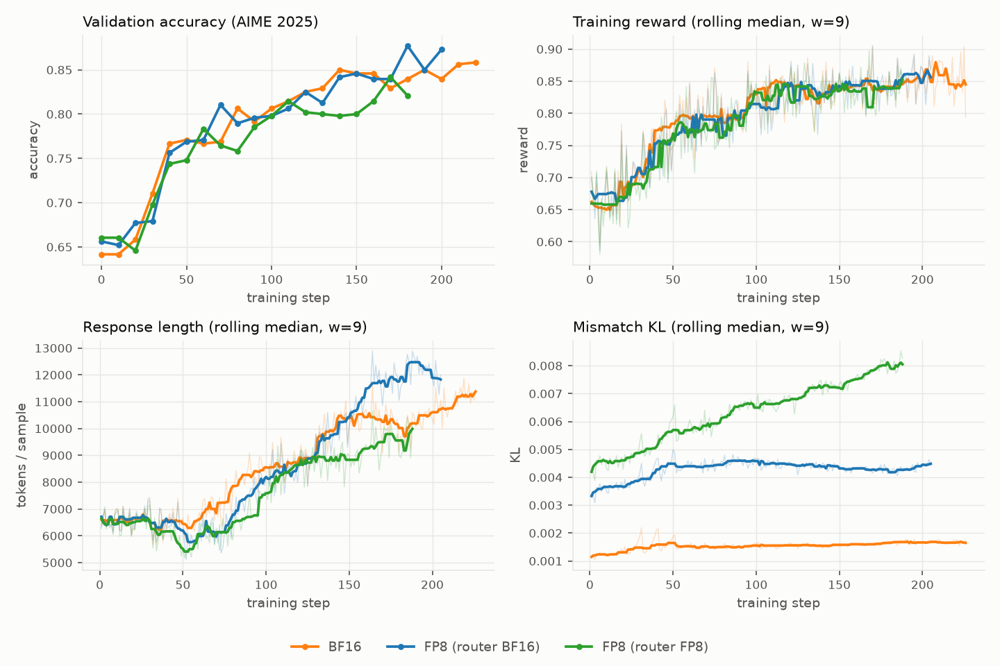
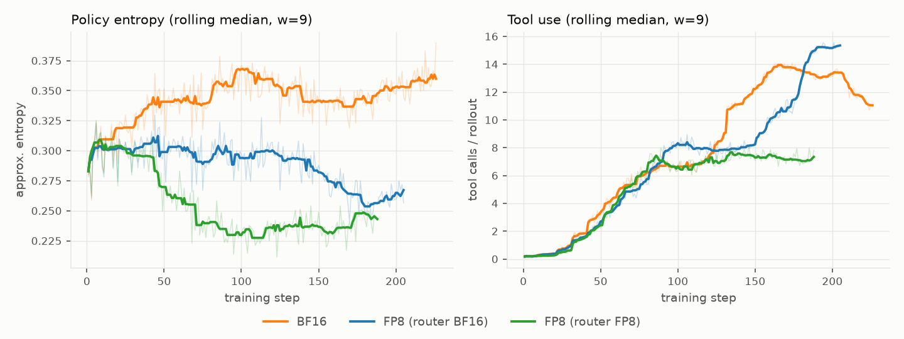

# FP8 Rollout for Multi-Turn Agentic RL: Qwen3-30B-A3B on math-with-code

> **Status**: source material for the multi-turn section of
> `low-precision-rl-tech-report` (which covers single-turn FP8 RL on
> Qwen3-8B/30B-Base with DAPO). This document follows that report's structure
> and figure conventions (orange = BF16, blue = FP8, green = ablation) so the
> results can be merged directly; the BF16 reference training curves below are
> the ones to preserve through the merge.

## Settings

**Training Setup.** We extend the tech report's FP8 W8A8 linear-rollout
evaluation from single-turn math RL to a multi-turn agentic task: boxed-answer
math problems where the policy iterates Python code in an isolated per-trial
container (nemo-gym Harbor harness, `MathCodeHarborAgent`, up to 16
model-call steps per rollout — each step may execute multiple Python tool
calls, and the loop ends early once the model answers without one).
Model: Qwen3-30B-A3B-Instruct-2507 (MoE, non-thinking). Framework: NeMo-RL
async GRPO on 4 GB200 nodes (4 GPUs/node) — 2 generation nodes (vLLM TP1, 8
replicas) and 2 training nodes (Megatron-Core TP4 x EP8), non-colocated,
`moe_backend=triton`. Training data: `dapo_math_17k_non8` (6389 DAPO prompts
Qwen3-8B did not solve 8/8) with ReTool-style tool-use reward shaping baked
into train tasks; online validation on AIME 2025 (30 tasks x 16 repeats,
shaping-free).

**Hyperparameters.** Prompt batch 64 with n=16 responses per prompt; async
GRPO with `max_trajectory_age_steps=1` and 64 in-flight prompt groups
(conc512). Token-level GRPO loss (clips 0.2/0.28, dual-clip c=10) with
token-level truncated importance sampling, C=2, applied to all arms — matching
the tech report's rollout-correction recipe. Maximum sequence length 20K.
Rollout FP8 is on-the-fly blockwise W8A8 (CUTLASS path, fp32 scales) applied
at refit time; training stays BF16 throughout.

**Metrics.** As in the tech report: (i) *validation accuracy* on AIME 2025;
(ii) *training reward*; (iii) *response length* (generated tokens per sample);
(iv) *mismatch KL* between rollout and training policy logprobs
(`train/gen_kl_error`). Multi-turn adds two behavioral metrics that have no
single-turn counterpart: (v) *policy entropy* (`train/approx_entropy`) and
(vi) *tool calls per rollout* — the task exhibits a phase transition into
heavy tool use, and whether that transition fires is the most sensitive
indicator of rollout-precision side effects we observed.

## Results: FP8 W8A8 Rollout with Token-Level TIS

Configurations: (i) BF16 reference (orange), (ii) FP8 W8A8 with the MoE router
excluded from quantization (blue) — the recommended configuration, matching
the official Qwen FP8 checkpoint's `modules_to_not_convert` — and (iii) FP8
W8A8 with the router quantized (green), kept as the router-precision ablation
(next section).



**Training effectiveness.** FP8 with the router in BF16 (blue) tracks the BF16
reference (orange) across all four training metrics. Validation accuracy stays
on the reference trajectory throughout and ends above it (best 0.877 / last
0.873 at step 200 vs 0.858 at step 220); reward curves overlap; response
length grows through the same multi-turn expansion. Mismatch KL sits at
~0.0045 — elevated over BF16's ~0.0015 by quantization as expected, but *flat*
across 200 steps, mirroring the stability the tech report observed for the
single-turn 30B MoE with TIS enabled.

**Multi-turn observations.** The agentic task adds a behavioral dimension
absent from single-turn RL: around step 130 the BF16 policy transitions into a
heavy-tool-use regime (~7 to ~14 calls/rollout) that drives the late accuracy
gains. The recommended FP8 configuration undergoes the same transition (~50
steps later, converging to ~15 calls/rollout) — rollout quantization delays
but does not suppress the behavioral phase transition, provided the router
stays in BF16.

**Rollout performance.**

| configuration | best val acc | last val acc (step) | median step time | median exposed generation | median gen tok/s per engine |
|---|---|---|---|---|---|
| BF16 | 0.858 | 0.858 (s220) | 509 s | 20.6 s | 20.9k |
| FP8 (router BF16) | **0.877** | 0.873 (s200) | 458 s (−10%) | 5.5 s | 22.2k (+6.2%) |
| FP8 (router FP8) | 0.842 | 0.821 (s180) | 431 s (−15%) | 5.2 s | 22.5k (+7.7%) |

Under async GRPO the step-time medians mix generation- and training-bound
windows; the cleaner generation-side signals are exposed generation time (~4x
lower under FP8 — generation hides almost entirely behind the training wall)
and per-engine throughput (+6–8% at this operating point). Two caveats
consistent with the tech report's roofline analysis: the per-stream FP8
advantage is workload-state-dependent (+18% at early-training behavior of 1–2
model calls per trajectory, compressing toward parity at late-training 14–15
calls, where precision-neutral per-call overhead and KV traffic dominate), and
throughput comparisons are only meaningful on matched-policy windows because
generation speed is itself behavior-dependent.

## Ablation: Router Precision

The tech report's single-turn router ablation (its §"Ablation: Router
Precision for MoE FP8 Rollout") established that quantizing the router
produces the highest mismatch KL and that BF16 ≈ FP32 for the router. The
multi-turn setting shows what that routing inconsistency does to the *policy*
over a longer horizon: it suppresses exploration and blocks the behavioral
phase transition the task depends on.



With the router quantized (green): policy entropy decays monotonically from
step ~20 to −35% below the reference (0.23 vs 0.37) instead of growing; the
tool-use phase transition never fires (pinned at ~7.4 calls/rollout); mismatch
KL grows steadily 0.004 → 0.008 (training-dynamics figure, bottom right); and
validation accuracy detaches from the reference after step ~120, plateauing
~0.80 with the residual gap concentrated in the hard problems solved only
through heavy tool iteration. Excluding the router (blue) arrests all three:
entropy stabilizes (~0.29, residual −15% vs BF16 with no accuracy cost),
mismatch KL flattens, and the phase transition completes.

Mechanism, consistent with the single-turn KL evidence: vLLM's on-the-fly
`Fp8Config` quantizes the router gate (`ReplicatedLinear`) by default, and
router noise flips top-8 expert selection near decision boundaries — a
discrete computation-path perturbation rather than smooth numeric error. The
RL loop then amplifies the sharpened sampling distribution, and importance
sampling cannot recover trajectories that were never explored. Fix (NeMo-RL):
`quantization_ignored_layer_kws: ["mlp.gate"]`. The official
Qwen3-30B-A3B-Instruct-2507-FP8 checkpoint likewise excludes all 48 `mlp.gate`
layers, and the Megatron trainer runs the router in FP32
(`moe_router_dtype`).

**Loss-function prerequisite.** Earlier windows of this campaign (not plotted)
ran GSPO: its sequence-level IS ratios are products over ~6k-token
trajectories, so FP8's per-token logprob bias compounds multiplicatively and
collapsed the applied sequence weights to ~0.024 (vs BF16's ~0.145) — a 6x
weaker gradient signal that flatlined the FP8 arm. Token-level GRPO+TIS
removes the compounding mechanism and is the baseline for everything above;
this is the multi-turn/MoE sharpening of the tech report's "importance of
rollout correction" finding.

## Data and Reproduction

Chains live in wandb project `nv-welcome/grpo-math-with-code`. Each 4h Slurm
window logs as a separate same-name run; `pull_wandb.py` stitches segments by
step (later segments win overlaps, since a requeued window resumes from the
last checkpoint). Internal arm names: `fp8-v3` = router FP8, `fp8-v4` = router
BF16.

| configuration | wandb chain | config |
|---|---|---|
| BF16 | `...-non8-async-v3-pty` | `configs/grpo_math_with_code_qwen3_30ba3b_instruct_async.yaml` |
| FP8 (router FP8) | `...-non8-async-fp8-v3-pty` | `..._fp8.yaml` |
| FP8 (router BF16) | `...-non8-async-fp8-v4-pty` | `..._fp8_v4.yaml` |

```bash
source ~/.exp_env   # WANDB_API_KEY
python pull_wandb.py            # -> data/<chain>.csv (one chain per process)
python make_figures.py          # -> figures/*.png + summary table
```

Any Python with `wandb`, `pandas`, `matplotlib` works (no repo venv needed).
